# FD Rate Scraper Architecture

This document explains the fixed deposit rate scraper, the API bridge that serves scraper output, and the way the treasury yield visualisation consumes FD data.

The implementation is split across three local areas:

- Scraper package: `/Users/aditya/Documents/scrape fd rates`
- API bridge: `/Users/aditya/Documents/Treasury Test/scrape fd rates/fd_rates_api`
- Frontend consumer: `/Users/aditya/Documents/ERP Investments Section/Treasury ERP Investments`

## Purpose

The scraper collects official retail fixed deposit rates from Indian bank sources, normalizes tenure/rate rows into a common format, writes CSV/JSON outputs, and exposes the latest rows to the yield calculator.

The current scope is RBI-bank FD issuers:

- Public sector banks
- Private sector banks
- Small finance banks
- Regional rural banks
- Foreign banks with India retail FD pages
- Local area banks

The current v1 exclusion list is:

- Payment banks
- Cooperative banks
- NBFC/HFC corporate FD issuers

## Current Coverage

The registry currently contains 82 enabled bank entries:

- 22 entries with `sourceStatus: ACTIVE`
- 60 entries with `sourceStatus: NEEDS_ADAPTER`

The current bundled scrape snapshot in this frontend app contains:

- `fd_rates.json`: 884 rows across 20 banks
- `fd_rates_final.json`: 157 LLM-normalized rows across 3 banks
- `run_report.json`: 20 successful banks, 60 skipped pending-adapter banks, 2 failed banks, 884 base rows

`NEEDS_ADAPTER` entries are kept enabled in the registry so they are visible as planned coverage, but they are skipped during scraping until a parser/source adapter is ready.

## High-Level Architecture

```mermaid
flowchart LR
  A["config/banks.yml<br/>Bank registry"] --> B["fd_rates.config<br/>Load and validate registry"]
  B --> C["fd_rates.scraper<br/>Per-bank scrape orchestration"]
  C --> D["fd_rates.fetch<br/>Fetch HTML, PDF, text, file sources"]
  D --> E["fd_rates.parser<br/>Generic and bank-specific parsing"]
  E --> F["FDRateRow<br/>Normalized Python model"]
  F --> G["fd_rates.exporters<br/>latest and snapshot JSON/CSV"]
  G --> H["data/latest/fd_rates.json<br/>data/latest/fd_rates_final.json<br/>data/latest/run_report.json"]
  H --> I["fd_rates_api<br/>FastAPI latest/sync endpoints"]
  H --> J["Vite public static fallback"]
  I --> K["React fdRatesApi.ts"]
  J --> K
  K --> L["YieldVisualisation.tsx<br/>Compare yield table"]
```



There are two frontend data modes:

1. Live API mode: the frontend calls `http://127.0.0.1:8000/api/fd-rates/latest`.
2. Static fallback mode: if the API is not available, the frontend reads bundled JSON from `public/data/fd-rates/latest`.

Static fallback is important for GitHub Pages, where there is no Python process running.

## Bank Registry

File:

`/Users/aditya/Documents/scrape fd rates/config/banks.yml`

Each bank is represented as a registry entry. Important fields:

```yaml
- id: sbi
  displayName: State Bank of India
  rbiCategory: PUBLIC_SECTOR_BANK
  aliases: [SBI]
  websiteUrl: https://sbi.co.in
  fdRateUrl: https://sbi.co.in/web/interest-rates/deposit-rates/retail-domestic-term-deposits
  parserStrategy: generic
  enabled: true
  sourceStatus: ACTIVE
  sources:
    - url: https://sbi.co.in/web/interest-rates/deposit-rates/retail-domestic-term-deposits
      type: html
```

Registry fields are loaded into `BankConfig` in:

`/Users/aditya/Documents/scrape fd rates/fd_rates/models.py`

Key registry concepts:

- `rbiCategory`: categorizes the institution by RBI banking class.
- `sourceStatus`: controls run behavior.
- `parserStrategy`: identifies generic parsing or a bank-specific parser.
- `sources`: one or more official URLs or file URLs to try.

Supported `sourceStatus` values:

- `ACTIVE`: scrape this bank.
- `NEEDS_ADAPTER`: known bank/source, but parser work remains; skip without failing.
- `NO_PUBLIC_FD_PAGE`: bank has no usable public FD page.
- `DISABLED`: do not include in the run.

Supported parser strategies:

- `generic`
- `icici_json`
- `yes_pdf`
- `bank_specific`

The loader validates IDs, required fields, categories, parser strategies, and source status in:

`/Users/aditya/Documents/scrape fd rates/fd_rates/config.py`

## Scraper Execution Flow

Main CLI entrypoint:

`/Users/aditya/Documents/scrape fd rates/fd_rates/cli.py`

Main scrape orchestrator:

`/Users/aditya/Documents/scrape fd rates/fd_rates/scraper.py`

Typical command:

```bash
fd-rates scrape --out data --banks all --format csv,json --allow-partial
```

Useful wider-registry run:

```bash
fd-rates scrape --banks all --out data --allow-partial --timeout 20 --retries 3 --concurrency 4
```

Execution steps:

1. `cli.py` parses command-line arguments.
2. `config.py` loads and validates `config/banks.yml`.
3. `select_banks()` chooses `all` banks or a comma-separated subset.
4. `scraper.py` creates a run ID and raw evidence directory.
5. Each bank is processed independently by `_scrape_bank()`.
6. `_scrape_bank()` skips non-active sources, fetches each configured source, parses rows, and returns a `BankResult`.
7. `exporters.py` writes latest outputs and historical snapshots.
8. `run_report.json` records success/failure/skip status per bank.

The key reliability behavior is that each bank produces an independent `BankResult`. A failed source does not crash the whole scrape. This is what lets the scraper run with `--allow-partial`.

## Fetch Layer

File:

`/Users/aditya/Documents/scrape fd rates/fd_rates/fetch.py`

Responsibilities:

- Fetch official source URLs.
- Support `file://` sources for tests and fixtures.
- Prefer `httpx`, with fallback to `urllib`.
- Apply browser-like request headers.
- Follow redirects.
- Use per-source timeout, retries, and backoff.
- Infer `source_type` from content type or URL extension.

Important output model:

```python
@dataclass(frozen=True)
class FetchedSource:
    url: str
    content: bytes
    content_type: str
    source_type: str
```

The fetch layer does not parse business meaning. It only returns bytes and source metadata.

## Parser Layer

Main parser:

`/Users/aditya/Documents/scrape fd rates/fd_rates/parser.py`

Supporting modules:

- `extract.py`: turns HTML/PDF/text into tables or rows.
- `rates.py`: identifies and parses rate columns.
- `tenure.py`: parses tenure labels into day ranges.
- `icici.py`: parses ICICI official JSON.
- `amounts.py`: normalizes amount slabs.

The generic parser works like this:

1. Convert the source into table-like rows.
2. Find a header row containing a tenure column and regular-customer rate columns.
3. Skip irrelevant contexts such as non-callable deposit tables.
4. Parse each tenure label into `min_days` and `max_days`.
5. Ignore rows outside the target window.
6. Parse regular-customer FD rates.
7. Infer amount slab context from table headers or source text.
8. Create `FDRateRow` records.
9. Deduplicate repeated rows.

Special cases:

- ICICI uses an official JSON source through `icici_json`.
- YES Bank uses a PDF parser path for its published PDF layout.

If parsing finds no retail FD rows, it raises `ParseError`, which becomes a per-bank `NO_RATES_FOUND` status.

## Core Data Models

File:

`/Users/aditya/Documents/scrape fd rates/fd_rates/models.py`

### `BankConfig`

Represents a registry entry after validation.

```python
@dataclass(frozen=True)
class BankConfig:
    id: str
    name: str
    sources: tuple[SourceConfig, ...]
    rbi_category: RbiCategory
    aliases: tuple[str, ...]
    website_url: str | None
    fd_rate_url: str | None
    parser_strategy: ParserStrategy
    enabled: bool
    source_status: SourceStatus
```

### `FDRateRow`

Represents one normalized FD rate row.

Important fields:

- `bank_id`
- `bank_name`
- `source_url`
- `source_type`
- `fetched_at`
- `effective_from`
- `customer_type`
- `product_type`
- `amount_slab`
- `tenure_label`
- `min_days`
- `max_days`
- `rate_pa`
- `raw_hash`

`FDRateRow.to_dict()` includes both snake_case fields and frontend-friendly camelCase aliases:

```json
{
  "bank_id": "sbi",
  "bank_name": "State Bank of India",
  "min_days": 7,
  "max_days": 45,
  "rate_pa": 3.05,
  "bankId": "sbi",
  "bankName": "State Bank of India",
  "tenorMinDays": 7,
  "tenorMaxDays": 45,
  "ratePercent": 3.05,
  "sourceUrl": "https://...",
  "retrievedAt": "2026-06-08T18:23:34+05:30"
}
```

### `BankResult`

Represents one bank's scrape outcome.

Statuses:

- `SUCCESS`
- `NO_RATES_FOUND`
- `PARSER_FAILED`
- `FETCH_FAILED`
- `SKIPPED`

### `ScrapeRun`

Represents the full run and aggregates all bank results into `rows` and `run_report.json`.

## Output Files

Output writer:

`/Users/aditya/Documents/scrape fd rates/fd_rates/exporters.py`

Latest output files:

- `data/latest/fd_rates.csv`
- `data/latest/fd_rates.json`
- `data/latest/fd_rates_final.csv`
- `data/latest/fd_rates_final.json`
- `data/latest/run_report.json`
- `data/latest/raw/`

Historical output files:

- `data/snapshots/YYYY-MM-DD/<run_id>/fd_rates.csv`
- `data/snapshots/YYYY-MM-DD/<run_id>/fd_rates.json`
- `data/snapshots/YYYY-MM-DD/<run_id>/run_report.json`
- `data/snapshots/YYYY-MM-DD/<run_id>/raw/`

`fd_rates.json` contains deterministic parser output.

`fd_rates_final.json` contains rows enriched by optional LLM normalization. It may be a subset of the base output if only some banks were normalized.

Consumers should merge `fd_rates.json` and `fd_rates_final.json` rather than choosing only the final file. The API bridge and frontend fallback both do this.

## Optional LLM Normalization

File:

`/Users/aditya/Documents/scrape fd rates/fd_rates/llm_normalizer.py`

LLM normalization is optional and is enabled with:

```bash
fd-rates scrape --banks sbi,hdfc,icici --out data --allow-partial --llm-normalize
```

or by passing `--openai-api-key`.

The normalizer sends batches of parsed rows to the OpenAI Responses API and asks for strict JSON normalization of:

- Tenure min/max days
- Amount min/max INR
- Amount inclusivity
- SQL-like amount condition
- Normalized amount slab label
- Confidence
- Notes
- Model name

The normalizer does not invent banks or rates. It only enriches parser rows.

The base parser already captures `min_days`, `max_days`, and `rate_pa`, so the LLM step is mainly useful for amount slab nuance and cleanup of irregular labels.

## API Bridge

Files:

- `/Users/aditya/Documents/Treasury Test/scrape fd rates/fd_rates_api/app.py`
- `/Users/aditya/Documents/Treasury Test/scrape fd rates/fd_rates_api/service.py`

The API bridge is a FastAPI app. It serves the latest scraped FD rates to the frontend and can trigger a scraper run in the background.

Key endpoints:

```text
GET  /health
GET  /api/fd-rates/latest?amount_inr=100000&tenure_days=30
GET  /api/fd-rates/sync/status
POST /api/fd-rates/sync
POST /api/rates/sync
```

`/api/fd-rates/latest`:

1. Loads latest rows from `data/latest`.
2. Merges `fd_rates.json` and `fd_rates_final.json`.
3. Filters rows by amount and tenure.
4. Selects the best rate per bank.
5. Returns frontend-ready rows plus sync status.

The API response shape is:

```json
{
  "rows": [
    {
      "bank_id": "kotak",
      "bank_name": "Kotak Mahindra Bank",
      "rate_pa": 6.8,
      "annualised_return_label": "6.80% p.a.",
      "estimated_return": 559,
      "estimated_return_label": "₹559",
      "tenure_label": "7 days to 45 days",
      "min_days": 7,
      "max_days": 45,
      "amount_slab": "Retail",
      "effective_from": "2026-06-01",
      "fetched_at": "2026-06-08T18:23:34+05:30",
      "source_url": "https://...",
      "last_sync_status": "partial_success"
    }
  ],
  "sync": {
    "status": "partial_success",
    "success_count": 18,
    "failure_count": 2,
    "row_count": 708,
    "message": "Synced 18 bank(s), 2 failed, 0 skipped"
  }
}
```

The API also includes scheduled sync support through APScheduler when available. A daily sync is configured at 6:00 AM Asia/Kolkata.

## Frontend Integration

Frontend adapter:

`/Users/aditya/Documents/ERP Investments Section/Treasury ERP Investments/src/app/data/fdRatesApi.ts`

Yield UI:

`/Users/aditya/Documents/ERP Investments Section/Treasury ERP Investments/src/app/components/YieldVisualisation.tsx`

Bundled fallback data:

`/Users/aditya/Documents/ERP Investments Section/Treasury ERP Investments/public/data/fd-rates/latest`

The frontend adapter has two data paths.

### Path 1: Live API

In local development, the adapter defaults to:

```text
http://127.0.0.1:8000/api/fd-rates/latest
```

The base URL can be overridden with:

```text
VITE_API_BASE_URL
```

### Path 2: Static Bundled Data

If the API fails or is unavailable, the adapter reads:

```text
public/data/fd-rates/latest/fd_rates.json
public/data/fd-rates/latest/fd_rates_final.json
public/data/fd-rates/latest/run_report.json
```

The static base URL can be overridden with:

```text
VITE_FD_RATES_DATA_URL
```

This static fallback lets the yield calculator work on GitHub Pages.

### Frontend Selection Logic

`fdRatesApi.ts` mirrors the API bridge:

1. Normalize amount and tenure from UI input.
2. Try live API first.
3. If the API fails, fetch static JSON.
4. Merge base and final rows.
5. Filter by valid rate, tenure, and amount.
6. Select the best matching row per bank.
7. Format rows for the yield table.

`YieldVisualisation.tsx` then maps API rows into `YieldComparisonRow` objects and merges them with mutual fund rows:

```ts
const fdRows = liveFdRows.length ? liveFdRows : mockFdRows;
const deploymentRows = [...mfRows, ...fdRows].filter((row) => row.available);
```

If FD scraper rows are loaded, the UI shows:

```text
FD rows use scraper output
```

If not, it falls back to static mock FD rows from `yieldData.ts`.

## Yield Calculation

The FD estimated return calculation is simple interest over the selected tenure:

```text
estimated_return = amount_inr * (rate_pa / 100) * tenure_days / 365
```

The annualized return shown in the UI is the scraped `rate_pa`.

The selected tenure affects:

- Which FD rows are eligible.
- The estimated return for each row.
- The benchmark max/min rows.
- The sorted deployment options.

## Error Handling

The scraper distinguishes these failure modes:

- Fetch failure: network/HTTP/file retrieval failed.
- Parser failure: parsing code failed unexpectedly.
- No rates found: source fetched, but no usable retail FD rows were detected.
- Skipped: source is not active or needs an adapter.

The run report preserves each bank's status:

```json
{
  "bank_id": "boi",
  "bank_name": "Bank of India",
  "status": "FETCH_FAILED",
  "row_count": 0,
  "error": "https://...: 403 Forbidden"
}
```

This is useful because production scraping is inherently noisy: banks change pages, block requests, publish PDFs, or modify tables without warning.

## Tests

Important scraper tests:

- `tests/test_config.py`
  - Registry has more than 20 banks.
  - Top-20 regression IDs remain present.
  - IDs are unique.
  - Excluded categories are not enabled.
  - `NEEDS_ADAPTER` entries load and skip cleanly.

- `tests/test_scraper_resilience.py`
  - One success, one skipped bank, and one failed bank are reported independently.
  - A partial run still returns successful rows.

- `tests/test_parser.py`
  - Generic table parsing and normalization behavior.

- `tests/test_api_service.py`
  - API filters by tenure and amount.
  - Best rate per bank selection.
  - CamelCase normalized scraper fields are accepted.
  - Base and final output files are merged correctly.

Common commands:

```bash
cd "/Users/aditya/Documents/scrape fd rates"
python3 -m pytest
```

```bash
cd "/Users/aditya/Documents/Treasury Test/scrape fd rates"
python3 -m pytest tests/test_api_service.py
```

```bash
cd "/Users/aditya/Documents/ERP Investments Section/Treasury ERP Investments"
npm run build
```

## How To Add A New Bank

1. Add or update the bank entry in `config/banks.yml`.
2. Set `sourceStatus: ACTIVE` only when there is a public official FD source and the parser can handle it.
3. Add the official FD URL under `sources`.
4. Start with `parserStrategy: generic`.
5. Run:

```bash
fd-rates scrape --banks <bank_id> --out data --allow-partial --verbose
```

6. Check:

- `data/latest/fd_rates.json`
- `data/latest/run_report.json`
- `data/latest/raw/<bank_id>.*`

7. If generic parsing fails, add a bank-specific parser path and tests.
8. Keep the bank as `NEEDS_ADAPTER` until its parser is reliable.

## How To Refresh Frontend Static Data

After running the scraper, copy the latest outputs into the Vite app:

```bash
cp "/Users/aditya/Documents/scrape fd rates/data/latest/fd_rates.json" \
  "/Users/aditya/Documents/ERP Investments Section/Treasury ERP Investments/public/data/fd-rates/latest/fd_rates.json"

cp "/Users/aditya/Documents/scrape fd rates/data/latest/fd_rates_final.json" \
  "/Users/aditya/Documents/ERP Investments Section/Treasury ERP Investments/public/data/fd-rates/latest/fd_rates_final.json"

cp "/Users/aditya/Documents/scrape fd rates/data/latest/run_report.json" \
  "/Users/aditya/Documents/ERP Investments Section/Treasury ERP Investments/public/data/fd-rates/latest/run_report.json"
```

Then rebuild the frontend:

```bash
cd "/Users/aditya/Documents/ERP Investments Section/Treasury ERP Investments"
npm run build
```

## Local API Runbook

From the API project:

```bash
cd "/Users/aditya/Documents/Treasury Test/scrape fd rates"
uvicorn fd_rates_api.app:app --reload --host 127.0.0.1 --port 8000
```

Then open:

```text
http://127.0.0.1:8000/api/fd-rates/latest?amount_inr=100000&tenure_days=30
```

With the API running, the frontend uses live API output first. If the API is down, the frontend uses bundled static scraper output.

## Known Limitations

- Many registry entries are `NEEDS_ADAPTER`; they represent coverage intent, not current successful scrape coverage.
- Generic table parsing can break when banks redesign pages.
- Some banks block automated requests with 403s or bot protection.
- Senior citizen, super senior, tax saver, NRI, staff, non-callable, and bulk-specific rows are not first-class in v1.
- `fd_rates_final.json` may contain only the subset that was LLM-normalized.
- Static frontend data must be manually refreshed unless a build/deploy job copies new scraper output.
- Mutual fund data is separate from the FD scraper and may still use its own fallback path.

## Production Recommendations

For a production-grade workflow:

1. Run the scraper on a schedule outside the frontend app.
2. Persist raw sources and normalized rows in durable object storage or a database.
3. Store per-bank scrape status and show operational monitoring.
4. Keep `config/banks.yml` versioned and reviewed.
5. Add bank-specific adapters for high-value `NEEDS_ADAPTER` banks.
6. Alert when a previously successful bank becomes `FETCH_FAILED` or `NO_RATES_FOUND`.
7. Generate and publish the static JSON bundle during deployment for GitHub Pages.
8. Add source URL and retrieved timestamp to every UI detail drawer for auditability.
